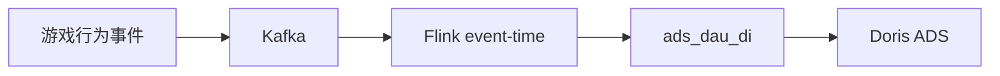

# GameStream

游戏行为事件实时指标：**Kafka → Flink（event-time）→ Doris ADS（`ads_dau_di`）**。
给 [DataPilot](https://github.com/tangyf07/DataPilot) 问数，经 [SQLGuard](https://github.com/tangyf07/SQLGuard) 门禁。

核心是 Flink SQL / 指标口径（`pipeline/`、`flink/`），不是 Shell 胶水。

## Why

埋点乱序、弱网重传。要按事件时间算 DAU：重复不双计、迟到可控、kill TM 后能恢复且计数不翻倍。

## Architecture



| 层 | 组件 |
|----|------|
| 接入 | Kafka `:19092` |
| 流处理 | Flink JM/TM（UI `:8081`），event-time + watermark |
| 物化 | 常驻 materializer：upsert-kafka → Doris UNIQUE KEY（显式分区 offset commit） |
| 服务 | Doris MySQL `:9030`（BE 须 Alive） |
| 验收指标 | 仅 **`ads_dau_di`** |

六节拍演示：[`docs/golden-path-demo.md`](docs/golden-path-demo.md)。G3–G8 / bench：[`docs/experiments.md`](docs/experiments.md) · [`bench/`](bench/)。

## Guarantees

| 能力 | 做法 | 证明 | Scope |
|------|------|------|-------|
| `event_id` 去重 | Rank / DISTINCT（默认 job-lifetime state；仅 TTL 启用后才为 bounded horizon，见 Design） | [G3](docs/g3-stream-semantics.md) | drill |
| watermark 迟到丢弃 | event-time 关窗（分钟窗） | [G3](docs/g3-stream-semantics.md) | drill |
| checkpoint 恢复 | restart-strategy | [G4](docs/g4-checkpoint-idempotency.md) / [G5](docs/g5-fault-drill.md) | drill |
| kill TM 不双计 | 同 job 拉回 + 幂等键 | [G5](docs/g5-fault-drill.md) | drill |
| Doris ALS | 写确认后 **显式 per-partition** offset commit | [G8 materializer](docs/g8-resident-materializer.md) | mainline/materializer |

不宣称 EO-2PC；Doris = at-least-once + UNIQUE KEY。

## Quickstart

```bash
docker compose up -d
bash scripts/demo_golden_path.sh
```

（WSL 从 `/mnt/c` 跑：先 `cp` 到 `/tmp` 并 `sed` 去 CRLF。细节见 [`docs/golden-path-demo.md`](docs/golden-path-demo.md)。）

## Evidence

```bash
docker exec gs-doris-fe mysql -h127.0.0.1 -P9030 -uroot -e \
  "SELECT dt, server_id, dau, metric_id FROM ads.ads_dau_di WHERE metric_id='ads_dau_di' AND dau>0 ORDER BY dt, server_id;"
```

对照：[`docs/e2e-g2-query-result.txt`](docs/e2e-g2-query-result.txt)。


## Design decisions

| 决策 | 原因 |
|------|------|
| 日 ADS **不设短 `state.ttl`** | 非窗口 `GROUP BY CAST(event_time AS DATE)` 需长期 day-bucket 状态；短 TTL（如 1d）会丢掉仍可订正的日内累加。关窗改用 TUMBLE 1 DAY，G8 主流水线不用。 |
| Rank `event_id` 去重 = **job-lifetime state** | 默认无 job-level TTL，去重状态随作业生命周期增长（非“始终有界”）。仅当运维启用 TTL 后才变为 **bounded horizon**；超窗重复可能再进入，不得宣称永久唯一。 |
| Materializer **显式 per-partition commit** | 禁止无参 `commit()`；仅在 Doris 写确认后提交已应用 offset（ALS）。脏 JSON → skip/DLQ，再推进 offset。 |
| Retention 仅 `window_complete` | 观察窗 `max_dt >= cohort_dt+N` 才吐行，避免未完成窗低估留存；`first_seen` = 首次观测活动日，非纯注册 cohort。 |
| Spark batch = **DWS + DAU only** | `spark/jobs/dws_ads_batch.py` 不做 retention/churn；口径见 `sql/metrics/` 与 DuckDB lite。 |

## Limitations

- G2 = 有界 E2E；G3–G5 = 独立演练；G8 持续主流水线见 docs，不在 suite required。
- 未宣称 K8s / Spark / Iceberg 生产部署，不编造 SLA / Lag / P95。
- lite（DuckDB，`scripts/run_all.sh`）与 Docker **同口径、不同运行时**。
- 脏/非法 Kafka JSON 当前 skip/ignore；生产应接入 DLQ。
- 无 G9；不扩新功能面。

## Docs

| 文档 | 内容 |
|------|------|
| [`docs/experiments.md`](docs/experiments.md) | G2–G8 实验索引（命令与结果入口） |
| [`docs/golden-path-demo.md`](docs/golden-path-demo.md) | 六节拍演示 |
| [`bench/`](bench/) | G6 / G8 压测结果 JSON |
| [`docs/datapilot_contract.md`](docs/datapilot_contract.md) | DataPilot / SQLGuard 契约 |
| [`config/metrics.yaml`](config/metrics.yaml) | 指标注册 |
| [`ARCHITECTURE.md`](ARCHITECTURE.md) | 短架构（ODS→ADS / lite） |
