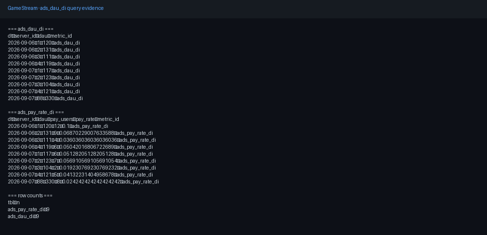

# GameStream

游戏行为事件实时指标：**Kafka → Flink（event-time）→ Doris ADS（`ads_dau_di`）**。
给 [DataPilot](https://github.com/tangyf07/DataPilot) 问数，经 [SQLGuard](https://github.com/tangyf07/SQLGuard) 门禁。

核心是 Flink SQL / 指标口径（`pipeline/`、`flink/`），不是 Shell 胶水。

## Problem

埋点乱序、弱网重传。要按事件时间算 DAU：重复不双计、迟到可控、kill TM 后能恢复且计数不翻倍。

## Architecture


| 层 | 组件 |
|----|------|
| 接入 | Kafka `:19092` |
| 流处理 | Flink JM/TM（UI `:8081`），event-time + watermark |
| 服务 | Doris MySQL `:9030`（BE 须 Alive） |
| 验收指标 | 仅 **`ads_dau_di`** |

六节拍演示：[`docs/golden-path-demo.md`](docs/golden-path-demo.md)。G3–G8 实验：[`docs/experiments.md`](docs/experiments.md)。

## Guarantees

| 能力 | 做法 | 证明 |
|------|------|------|
| `event_id` 去重 | upsert / DISTINCT | [G3](docs/g3-stream-semantics.md) |
| watermark 迟到丢弃 | event-time 关窗 | [G3](docs/g3-stream-semantics.md) |
| checkpoint 恢复 | restart-strategy | [G4](docs/g4-checkpoint-idempotency.md) / [G5](docs/g5-fault-drill.md) |
| kill TM 不双计 | 同 job 拉回 + 幂等键 | [G5](docs/g5-fault-drill.md) |

不宣称 EO-2PC；Doris = at-least-once + UNIQUE KEY。

## Quickstart

```bash
docker compose up -d
bash scripts/demo_golden_path.sh
```

（WSL 从 `/mnt/c` 跑：先 `cp` 到 `/tmp` 并 `sed` 去 CRLF。细节见 [`docs/golden-path-demo.md`](docs/golden-path-demo.md)。）

## Evidence

```bash
docker exec gs-doris-fe mysql -h127.0.0.1 -P9030 -uroot -e \
  "SELECT dt, server_id, dau, metric_id FROM ads.ads_dau_di WHERE metric_id='ads_dau_di' AND dau>0 ORDER BY dt, server_id;"
```

对照：[`docs/e2e-g2-query-result.txt`](docs/e2e-g2-query-result.txt)。



## Limitations

- G2 = 有界 E2E；G3–G5 = 独立演练；G8 持续主流水线见 docs，不在 suite required。
- 未宣称 K8s / Spark / Iceberg 生产部署，不编造 SLA / Lag / P95。
- lite（DuckDB，`scripts/run_all.sh`）与 Docker **同口径、不同运行时**。
- 实验索引：[`docs/experiments.md`](docs/experiments.md) · 契约：[`docs/datapilot_contract.md`](docs/datapilot_contract.md) · [`config/metrics.yaml`](config/metrics.yaml)
