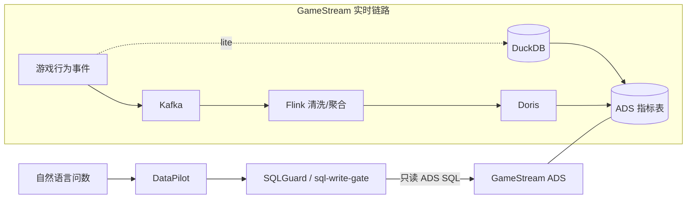

# GameStream

一句话：面向游戏玩家行为的**实时指标平台**（采集→清洗→分层 ADS），给 [DataPilot](https://github.com/tangyf07/DataPilot) 问数、经 [sql-write-gate](https://github.com/tangyf07/sql-write-gate)（SQLGuard）门禁消费——不是又一个数仓作业，也不是电商订单流水。

- DataPilot：https://github.com/tangyf07/DataPilot  
- SQLGuard（sql-write-gate）：https://github.com/tangyf07/sql-write-gate  
- 指标契约：[`docs/datapilot_contract.md`](docs/datapilot_contract.md) · [`config/metrics.yaml`](config/metrics.yaml)



## 写死口径：lite vs 生产组件

| | **本机默认可跑（lite）** | **WSL Docker（G1 组件 + G2 E2E）** |
|--|--------------------------|-----------------------------------|
| 怎么跑 | `scripts/run_all.sh` / `run_all.ps1` → DuckDB | `docker compose up -d`（WSL） |
| 接入 | `FileTopic` JSONL | **Kafka** `apache/kafka:3.7`（`:19092`） |
| 流处理 | `pipeline/local_runner.py` | **Flink** JM/TM（UI `:8081`） |
| OLAP | Parquet + DuckDB | **Doris** FE/BE（HTTP `:8030` / MySQL `:9030`） |
| 端到端 | lite ADS 在 DuckDB | **G2 已验证**：Simulator→Kafka→Flink→Doris ADS（见 [`docs/e2e-g2.md`](docs/e2e-g2.md)） |

**勿夸大：** G1 = 组件可起 + 端口可达。**G2 = 有界 E2E**（batch + bounded Kafka → 一次性 Doris ADS，可复跑 `e2e_g2.sh`，作对照保留）。**G3–G5 = 独立演练**（watermark / checkpoint / kill-TM）；**G8 已把它们折进同一条持续 Doris ADS 主流水线**（见 [`docs/g8-continuous-mainline.md`](docs/g8-continuous-mainline.md)）。**G6 已做**：Docker 栈实测吞吐/Lag/Checkpoint/E2E P95/反压（见 [`docs/g6-bench.md`](docs/g6-bench.md)，数字只引自 `bench/results/g6_*.json`；G8 小规模分块负载见 [`docs/g8-steady-bench.md`](docs/g8-steady-bench.md)，不编造）。**G7 已做**：NL/Agent→SQLGuard→Doris ADS 闭环（strict hallucination；见 [`docs/g7-closed-loop.md`](docs/g7-closed-loop.md)）——消费**已有** ADS 行，不负责灌数。**未宣称** 倾斜专项、编造 SLA、K8s/Spark/Iceberg 生产部署、端到端 EO-2PC。lite 与 prod **同口径**（同一套 `metric_id`）。

## 三仓固化验收

**三仓固化验收**：[`docs/suite-acceptance.md`](docs/suite-acceptance.md)（GameStream `2253b25`+ / SQLGuard `7dc85dd`=1.1.2 / DataPilot **`2541623`**；默认 **strict** 门禁；G8 不在 suite required 内，见下文）。

细节与状态语义见文档；跑：`bash scripts/suite_acceptance.sh`（WSL 请先 `sed` 去 CRLF）。报告：[`docs/suite-acceptance-result.txt`](docs/suite-acceptance-result.txt)。

## G2 快速跑（WSL，小流量）

```bash
# 栈已 up 后：
bash scripts/e2e_g2.sh
# 默认 --players 500 --events 3000；结果落 docs/e2e-g2-query-result.txt
```

细节：[`docs/e2e-g2.md`](docs/e2e-g2.md)。


## G3 流语义（WSL，小流量）

```bash
# 栈已 up 后：
cp scripts/g3_stream_semantics.sh /tmp/g3.sh && sed -i 's/\r$//' /tmp/g3.sh
GAMESTREAM_ROOT=/mnt/c/Users/tangy/source/repos/GameStream bash /tmp/g3.sh
```

细节：[`docs/g3-stream-semantics.md`](docs/g3-stream-semantics.md)（event time、watermark、迟到丢弃、`event_id` 去重）。**不含** G4–G6。

## G4 Checkpoint / 幂等（WSL，小流量）

```bash
# 若刚改 compose：先 recreate JM/TM 以挂载 ./flink/checkpoints
docker compose up -d --force-recreate jobmanager taskmanager
cp scripts/g4_checkpoint_idempotency.sh /tmp/g4.sh && sed -i 's/\r$//' /tmp/g4.sh
GAMESTREAM_ROOT=/mnt/c/Users/tangy/source/repos/GameStream bash /tmp/g4.sh
```

细节：[`docs/g4-checkpoint-idempotency.md`](docs/g4-checkpoint-idempotency.md)（10s checkpoint、`file:///checkpoints`、cancel→restore、充值 `event_id` 不双计）。**不含** G5–G7。Doris = ALS + UNIQUE KEY，**不**宣称端到端 EO-2PC。


## G5 故障演练（WSL，kill TaskManager）

```bash
# 若刚改 compose（restart-strategy）：先 recreate JM/TM
docker compose up -d --force-recreate jobmanager taskmanager
cp scripts/g5_fault_drill.sh /tmp/g5.sh && sed -i 's/\r$//' /tmp/g5.sh
GAMESTREAM_ROOT=/mnt/c/Users/tangy/source/repos/GameStream bash /tmp/g5.sh
```

细节：[`docs/g5-fault-drill.md`](docs/g5-fault-drill.md)（`docker kill gs-flink-tm`、fixed-delay 恢复、checkpoint→barrier→state→offset→replay→dedup）。**不含** G6–G7。Doris = ALS + UNIQUE KEY，**不**宣称端到端 EO-2PC。


## G6 实测压测（WSL，Kafka sink）

```bash
cp scripts/g6_bench.sh /tmp/g6.sh && sed -i 's/\r$//' /tmp/g6.sh
GAMESTREAM_ROOT=/mnt/c/Users/tangy/source/repos/GameStream TIER=light bash /tmp/g6.sh
```

细节：[`docs/g6-bench.md`](docs/g6-bench.md)。**数字只引用**已提交的 [`bench/results/g6_*.json`](bench/results/)（无实测则写未测到，不编造）。

## G7 AI 闭环（WSL，SQLGuard → Doris ADS）

```bash
# 栈已 up 且 ADS 有行；SQLGuard 1.1 [mysql] 已装
cp scripts/g7_closed_loop.sh /tmp/g7.sh && sed -i 's/\r$//' /tmp/g7.sh
GAMESTREAM_ROOT=/mnt/c/Users/tangy/source/repos/GameStream MODE=fixture bash /tmp/g7.sh
```

细节：[`docs/g7-closed-loop.md`](docs/g7-closed-loop.md)（fixture Prompt→SQL→`/v1/check|/v1/execute`→ADS 行；strict `allow_unknown_*=false`；可选 DataPilot）。合法 ADS SELECT **各返回若干行**（见 result transcript，勿写「EXECUTE×N」）。**不含** 新 UI / 编造指标（灌数见 G8）。


## G8 持续 Doris ADS 主流水线（WSL）

```bash
cp scripts/g8_continuous_mainline.sh /tmp/g8.sh && sed -i 's/\r$//' /tmp/g8.sh
GAMESTREAM_ROOT=/mnt/c/Users/tangy/source/repos/GameStream bash /tmp/g8.sh
```

细节：[`docs/g8-continuous-mainline.md`](docs/g8-continuous-mainline.md)（**单一持续 Flink 作业＋脚本阶段物化 Doris**：Kafka→清洗/`event_id` 去重→日 DAU+付费率→upsert-kafka→**脚本** UNIQUE KEY 物化；同 job kill-TM 恢复不双计；`tm_start_fallback=1` / chk-8 精确 restore 未单独证明）。**对照 G2 有界批**；G3–G5 折入同一 pipeline。**无**常驻 Doris materializer；Flink JDBC MySQL upsert 方言 Doris 拒收故不用；**不**宣称 EO-2PC。无编造 bench 数字。

## G8 小规模分块负载与批次可见性验证（WSL）

```bash
cp scripts/g8_steady_bench.sh /tmp/g8s.sh && sed -i 's/\r$//' /tmp/g8s.sh
GAMESTREAM_ROOT=/mnt/c/Users/tangy/source/repos/GameStream TIER=light bash /tmp/g8s.sh
# optional medium (only if light stable / mem ok):
# GAMESTREAM_ROOT=/mnt/c/Users/tangy/source/repos/GameStream TIER=medium bash /tmp/g8s.sh
```

细节：[`docs/g8-steady-bench.md`](docs/g8-steady-bench.md)。**数字只引用**已提交的 [`bench/results/g8_*.json`](bench/results/)。表述：两档各 2 次批次探针，当前脚本物化路径下约 **39–41s 可查**（n=2≈max，**勿卖 P95**；含 console-consumer 串行开销）。Flink in/s = **sum across operators，非 source 吞吐**。**不**把 G6 Kafka-only 数字标成 G8 Doris-visible；**无**常驻 Doris materializer。

## 事件与分层

11 类：`login | create_role | enter_dungeon | clear_dungeon | death | equip | enhance | recharge | gacha | friend | logout`（`simulator/`）。

ODS → DWD → DWS → ADS（DAU / 留存 / 在线时长 / 付费率 / ARPU / 副本通关率 / 流失）。

## 如何跑 / 测试（lite）

```bash
python3 -m venv .venv && . .venv/bin/activate
pip install -r requirements.txt
bash scripts/quality_gate.sh
bash scripts/run_all.sh --players 2000 --events 20000
```

Windows：`.\scripts\quality_gate.ps1` / `.\scripts\run_all.ps1`。

## 二面深挖

- [`docs/flink-kafka-deep-dive.md`](docs/flink-kafka-deep-dive.md)
- [`docs/g3-stream-semantics.md`](docs/g3-stream-semantics.md)（G3 watermark / 乱序 / 去重）
- [`docs/g5-fault-drill.md`](docs/g5-fault-drill.md)（G5 kill-TM / failover）
- [`docs/interview-faq.md`](docs/interview-faq.md)
- `flink/conf/checkpoint-recommendations.yaml` · `flink/sql/*` · `flink/jobs/*`

## 压测

仅提交实测：`bench/results/g6_*.json` / `bench/results/g8_*.json` / `bench/results/bench_*.json`。无实测时 **不编造** Lag / Checkpoint / P95。G6：[`docs/g6-bench.md`](docs/g6-bench.md)。G8 分块负载：[`docs/g8-steady-bench.md`](docs/g8-steady-bench.md)。
