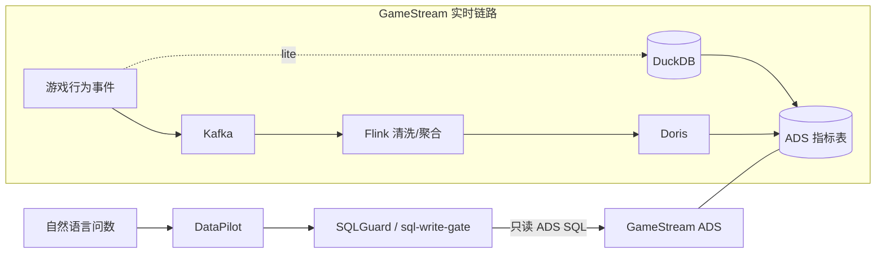

# GameStream

一句话：面向游戏玩家行为的**实时指标平台**（采集→清洗→分层 ADS），给 [DataPilot](https://github.com/tangyf07/DataPilot) 问数、经 [sql-write-gate](https://github.com/tangyf07/sql-write-gate)（SQLGuard）门禁消费——不是又一个数仓作业，也不是电商订单流水。

- DataPilot：https://github.com/tangyf07/DataPilot  
- SQLGuard（sql-write-gate）：https://github.com/tangyf07/sql-write-gate  
- 指标契约：[`docs/datapilot_contract.md`](docs/datapilot_contract.md) · [`config/metrics.yaml`](config/metrics.yaml)



## 写死口径：lite vs 生产组件

| | **本机默认可跑（lite）** | **WSL Docker（G1 组件 + G2 E2E）** |
|--|--------------------------|-----------------------------------|
| 怎么跑 | `scripts/run_all.sh` / `run_all.ps1` → DuckDB | `docker compose up -d`（WSL） |
| 接入 | `FileTopic` JSONL | **Kafka** `apache/kafka:3.7`（`:19092`） |
| 流处理 | `pipeline/local_runner.py` | **Flink** JM/TM（UI `:8081`） |
| OLAP | Parquet + DuckDB | **Doris** FE/BE（HTTP `:8030` / MySQL `:9030`） |
| 端到端 | lite ADS 在 DuckDB | **G2 已验证**：Simulator→Kafka→Flink→Doris ADS（见 [`docs/e2e-g2.md`](docs/e2e-g2.md)） |

**勿夸大：** G1 = 组件可起 + 端口可达。G2 = 小规模 E2E 写入 Doris ADS（`ads_dau_di` / `ads_pay_rate_di`）。G3 = event-time watermark / 乱序·迟到 / `event_id` 去重（见 [`docs/g3-stream-semantics.md`](docs/g3-stream-semantics.md)）。**未宣称** G4–G6（checkpoint 失败演练、倾斜专项、Lag/吞吐/P95 压测编造、K8s/Spark/Iceberg 生产部署）。lite 与 prod **同口径**（同一套 `metric_id`）。

## G2 快速跑（WSL，小流量）

```bash
# 栈已 up 后：
bash scripts/e2e_g2.sh
# 默认 --players 500 --events 3000；结果落 docs/e2e-g2-query-result.txt
```

细节：[`docs/e2e-g2.md`](docs/e2e-g2.md)。


## G3 流语义（WSL，小流量）

```bash
# 栈已 up 后：
cp scripts/g3_stream_semantics.sh /tmp/g3.sh && sed -i 's/\r$//' /tmp/g3.sh
GAMESTREAM_ROOT=/mnt/c/Users/tangy/source/repos/GameStream bash /tmp/g3.sh
```

细节：[`docs/g3-stream-semantics.md`](docs/g3-stream-semantics.md)（event time、watermark、迟到丢弃、`event_id` 去重）。**不含** G4–G6。

## 事件与分层

11 类：`login | create_role | enter_dungeon | clear_dungeon | death | equip | enhance | recharge | gacha | friend | logout`（`simulator/`）。

ODS → DWD → DWS → ADS（DAU / 留存 / 在线时长 / 付费率 / ARPU / 副本通关率 / 流失）。

## 如何跑 / 测试（lite）

```bash
python3 -m venv .venv && . .venv/bin/activate
pip install -r requirements.txt
bash scripts/quality_gate.sh
bash scripts/run_all.sh --players 2000 --events 20000
```

Windows：`.\scripts\quality_gate.ps1` / `.\scripts\run_all.ps1`。

## 二面深挖

- [`docs/flink-kafka-deep-dive.md`](docs/flink-kafka-deep-dive.md)
- [`docs/g3-stream-semantics.md`](docs/g3-stream-semantics.md)（G3 watermark / 乱序 / 去重）
- [`docs/interview-faq.md`](docs/interview-faq.md)
- `flink/conf/checkpoint-recommendations.yaml` · `flink/sql/*` · `flink/jobs/*`

## 压测

仅提交实测：`bench/results/*.json`。无实测时 **不编造** Lag / Checkpoint / P95。
