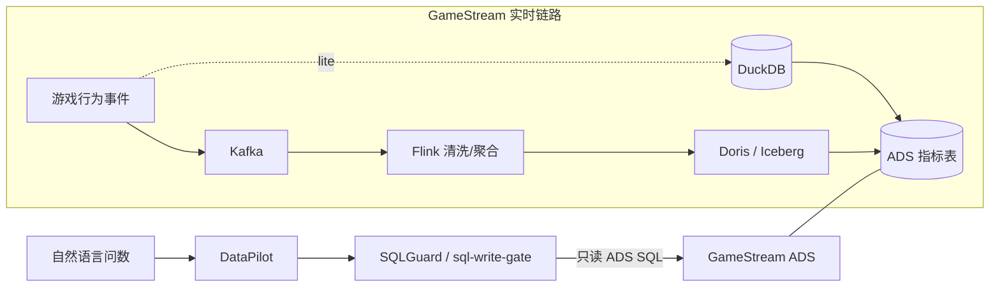

# GameStream

一句话：面向游戏玩家行为的**实时指标平台**（采集→清洗→分层 ADS），给 [DataPilot](https://github.com/tangyf07/DataPilot) 问数、经 [sql-write-gate](https://github.com/tangyf07/sql-write-gate)（SQLGuard）门禁消费——不是又一个数仓作业，也不是电商订单流水。

- DataPilot：https://github.com/tangyf07/DataPilot  
- SQLGuard（sql-write-gate）：https://github.com/tangyf07/sql-write-gate  
- 指标契约：[`docs/datapilot_contract.md`](docs/datapilot_contract.md) · [`config/metrics.yaml`](config/metrics.yaml)



## 写死口径：lite vs 生产参考

| | **本机默认可跑（lite）** | **生产参考（代码在仓，默认未拉起）** |
|--|--------------------------|----------------------------------------|
| 怎么跑 | `scripts/run_all.sh` / `run_all.ps1` → DuckDB | `docker compose --profile full` + `flink/sql` |
| 接入 | `FileTopic` JSONL | Kafka / Redpanda |
| 流处理 | `pipeline/local_runner.py` | Flink SQL/Job |
| OLAP | Parquet + DuckDB | Doris / Iceberg DDL |
| 状态 | **已在 Windows/Linux 质量门跑通** | **当前构建机与 tangyf 均无 Docker，未上集群**；说明见 [`docs/docker-compose-status.md`](docs/docker-compose-status.md) |

不要把 Flink/Kafka/Doris 说成「本机已经跑着」——那是面试用的生产形状参考，与 lite **同口径**（同一套 `metric_id`）。

## 事件与分层

11 类：`login | create_role | enter_dungeon | clear_dungeon | death | equip | enhance | recharge | gacha | friend | logout`（`simulator/`）。

ODS → DWD → DWS → ADS（DAU / 留存 / 在线时长 / 付费率 / ARPU / 副本通关率 / 流失）。

## 如何跑 / 测试

```bash
python3 -m venv .venv && . .venv/bin/activate
pip install -r requirements.txt
bash scripts/quality_gate.sh
bash scripts/run_all.sh --players 2000 --events 20000
```

Windows：`.\scripts\quality_gate.ps1` / `.\scripts\run_all.ps1`。

## 二面深挖

- [`docs/flink-kafka-deep-dive.md`](docs/flink-kafka-deep-dive.md)
- [`docs/interview-faq.md`](docs/interview-faq.md)
- `flink/conf/checkpoint-recommendations.yaml` · `flink/sql/*` · `flink/jobs/*`

## 压测

仅提交实测：`bench/results/*.json`。无 Kafka 集群时 **不编造** Lag / Checkpoint / P95。
