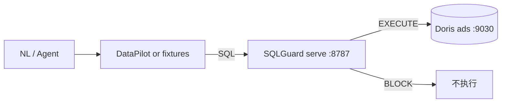

# G7 AI 数据工程闭环：DataPilot → SQLGuard → GameStream Doris ADS

目标：自然语言 / Agent（DataPilot 或 Agent-shaped fixture）生成只读 SQL → **SQLGuard**（`sql-write-gate` ≥ 1.1）`BLOCK`/`EXECUTE` → 查 **GameStream Doris ADS**。  
**不**编造指标、**不**新建 UI。口径以 [`datapilot_contract.md`](datapilot_contract.md) + [`../config/metrics.yaml`](../config/metrics.yaml) 为准。



## 启动顺序

1. **G1 栈 up**（Kafka / Flink / Doris FE:9030）。`docker compose ps` 见 `gs-doris-fe` healthy。
2. **ADS 有行**：若 `ads.ads_dau_di` / `ads.ads_pay_rate_di` 为空，先跑 G2：
   ```bash
   bash scripts/e2e_g2.sh
   ```
3. **安装 SQLGuard（WSL 推荐 venv）**：
   ```bash
   python3 -m venv --without-pip ~/g7-venv
   curl -fsSL https://bootstrap.pypa.io/get-pip.py -o /tmp/get-pip.py
   ~/g7-venv/bin/python /tmp/get-pip.py
   ~/g7-venv/bin/pip install -e "/mnt/c/Users/tangy/source/repos/sql-write-gate[mysql]"
   export PATH="$HOME/g7-venv/bin:$PATH"
   ```
4. **启动 SQLGuard HTTP**（也可由 `scripts/g7_closed_loop.sh` 自动拉起）：
   ```bash
   GS=/mnt/c/Users/tangy/source/repos/GameStream
   sql-write-gate serve --host 127.0.0.1 --port 8787 \
     --policy "$GS/config/sqlguard/g7_policy.yaml" \
     --catalog "$GS/config/sqlguard/g7_catalog.json" \
     --database "mysql://root@127.0.0.1:9030/ads"
   ```
5. **探活**：`curl -s http://127.0.0.1:8787/healthz` → `product=SQLGuard` / `version=1.1.0`。
6. **跑闭环**：
   ```bash
   cp scripts/g7_closed_loop.sh /tmp/g7.sh && sed -i 's/\r$//' /tmp/g7.sh
   GAMESTREAM_ROOT=/mnt/c/Users/tangy/source/repos/GameStream MODE=fixture bash /tmp/g7.sh
   # 结果：docs/g7-closed-loop-result.txt
   ```

### 可选：真 DataPilot 链路（Windows / WSL）

若本机 DataPilot 可起（mock LLM + write_gate + Doris）：

```powershell
cd C:\Users\tangy\source\repos\DataPilot
pip install -e ".[dev]"; pip install pymysql
# 另需 sql-write-gate 1.1 [mysql]
$env:DATAPILOT_LLM_MODE='mock'
$env:DATAPILOT_GUARD_MODE='write_gate'
$env:DATAPILOT_QUERY_BACKEND='doris'
$env:DATAPILOT_DORIS_URL='mysql://root@127.0.0.1:9030/ads'
$env:DATAPILOT_GUARD_CATALOG='..\GameStream\config\sqlguard\g7_catalog.json'
$env:DATAPILOT_GUARD_POLICY='..\GameStream\config\sqlguard\g7_policy.yaml'
python -m datapilot "DAU多少"
```

本次验收以 **fixture + SQLGuard HTTP** 为准（DataPilot ChatBI 未强制起服）；fixture 仍是 Agent-shaped：`Prompt → SQL → gate → rows`。

## 环境变量

| 变量 | 默认 | 说明 |
|------|------|------|
| `GAMESTREAM_ROOT` | 脚本推断 | GameStream 根目录 |
| `GUARD_URL` | `http://127.0.0.1:8787` | SQLGuard serve |
| `DORIS_URL` | `mysql://root@127.0.0.1:9030/ads` | Doris MySQL 协议 |
| `POLICY` | `config/sqlguard/g7_policy.yaml` | SELECT-only ADS |
| `CATALOG` | `config/sqlguard/g7_catalog.json` | 最小 ADS 列目录 |
| `SQLGUARD_REPO` | sibling `sql-write-gate` | PYTHONPATH / pip editable |
| `DATAPILOT_REPO` | sibling `DataPilot` | 可选真链路 |
| `MODE` | `auto` | `auto`\|`datapilot`\|`fixture` |
| `START_GUARD` | `1` | 无 healthz 时自动 `serve` |
| `RESULT_FILE` | `docs/g7-closed-loop-result.txt` | 运行 transcript |

## Policy / Catalog 要点

- `rules`: select **allow**；insert/update/delete/ddl **block**
- `permissions.enforce: true`；表名用**裸名**（`ads_dau_di` 等，无 `ads.*` 通配）→ `[select]`
- 联调：`hallucination.allow_unknown_tables/columns: true`
- `metric_id` / 表名与契约一致：`ads_dau_di`、`ads_pay_rate_di`、…

契约未改；DataPilot / SQLGuard 继续消费同一 `metric_id`。

## 失败 / 重试

| 现象 | 处理 |
|------|------|
| ADS `COUNT(*)=0` | 跑 `scripts/e2e_g2.sh` 再重试 |
| `/healthz` 失败 | 确认 `sql-write-gate serve`；或 `START_GUARD=1` |
| `datapilot=BLOCK` | 读 `rule_id`/`reason`；改 SQL（勿绕过门禁） |
| `/v1/execute` 未 `executed` | 检查 `DORIS_URL` / pymysql；脚本会 fallback `docker exec … mysql`（仅在已 EXECUTE 后） |
| DataPilot 起不来 | `MODE=fixture`（本仓默认验收路径） |
| HTTP 门禁挂掉 | 脚本回退 `write_gate.datapilot.block_or_execute` |

最多：门禁失败不执行；不在 GameStream 侧发明二次「绕过执行」。

## 样本路径（真实 transcript，摘自 `g7-closed-loop-result.txt`）

运行时间：**2026-09-07 10:39:39 CST**；SQLGuard **1.1.0**；ADS 各 **8** 行。

### Path 1 — DAU（EXECUTE + rows）

- **Prompt**: `DAU多少？按日期和服区分组`
- **SQL**:
  ```sql
  SELECT dt, server_id, dau, metric_id
  FROM ads.ads_dau_di
  WHERE metric_id = 'ads_dau_di'
  ORDER BY dt, server_id
  ```
- **Gate** (`POST /v1/check`): `datapilot=EXECUTE` / `action=ALLOW` / `rule_id=ok`
- **Execute** (`POST /v1/execute`): `executed=true` / `rowcount=8`
- **Rows**（节选）:
  | dt | server_id | dau | metric_id |
  |----|-----------|-----|-----------|
  | 2026-09-06 | 1 | 125 | ads_dau_di |
  | 2026-09-06 | 2 | 135 | ads_dau_di |
  | 2026-09-06 | 3 | 114 | ads_dau_di |
  | 2026-09-06 | 4 | 125 | ads_dau_di |
  | 2026-09-07 | 1 | 26 | ads_dau_di |
  | 2026-09-07 | 2 | 22 | ads_dau_di |
  | 2026-09-07 | 3 | 27 | ads_dau_di |
  | 2026-09-07 | 4 | 20 | ads_dau_di |

### Path 2 — 付费率（EXECUTE + rows）

- **Prompt**: `各服付费率是多少？给出 DAU、付费人数和付费率`
- **SQL**:
  ```sql
  SELECT dt, server_id, dau, pay_users, pay_rate, metric_id
  FROM ads.ads_pay_rate_di
  WHERE metric_id = 'ads_pay_rate_di'
  ORDER BY dt, server_id
  ```
- **Gate**: `datapilot=EXECUTE` / `action=ALLOW`
- **Execute**: `executed=true` / `rowcount=8`
- **Rows**（节选）:
  | dt | server_id | dau | pay_users | pay_rate | metric_id |
  |----|-----------|-----|-----------|----------|-----------|
  | 2026-09-06 | 1 | 125 | 17 | 0.136 | ads_pay_rate_di |
  | 2026-09-06 | 2 | 135 | 15 | 0.111… | ads_pay_rate_di |
  | 2026-09-06 | 3 | 114 | 6 | 0.052… | ads_pay_rate_di |
  | 2026-09-06 | 4 | 125 | 9 | 0.072 | ads_pay_rate_di |
  | 2026-09-07 | 1 | 26 | 1 | 0.038… | ads_pay_rate_di |
  | 2026-09-07 | 2 | 22 | 1 | 0.045… | ads_pay_rate_di |
  | 2026-09-07 | 3 | 27 | 0 | 0.0 | ads_pay_rate_di |
  | 2026-09-07 | 4 | 20 | 1 | 0.05 | ads_pay_rate_di |

### Path 3 — 故意 BLOCK

- **Prompt**: `(negative) 清空 DAU 表`
- **SQL**: `DELETE FROM ads.ads_dau_di`
- **Gate**: `datapilot=BLOCK` / `rule_id=delete_without_where` / `executed=false`
- **Doris**: 未执行

完整 JSON transcript：[`g7-closed-loop-result.txt`](g7-closed-loop-result.txt)。

## 相关文件

| 路径 | 作用 |
|------|------|
| `scripts/g7_closed_loop.sh` | 闭环编排 |
| `scripts/g7_agent_fixtures.py` | 确定性 NL→SQL |
| `config/sqlguard/g7_policy.yaml` | SQLGuard 策略 |
| `config/sqlguard/g7_catalog.json` | 最小 ADS catalog |

**不含** G8+；G2–G6 行为不变。
